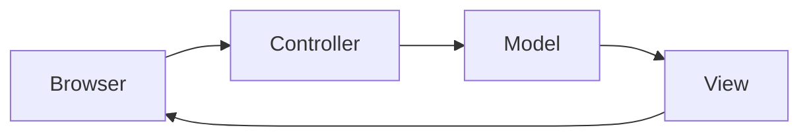

# 1. Spring MVC（Model / View / Controller）

## 1.1 MVC とは（概念）

Spring MVC は Web アプリケーションを  
**Model（データ） / View（画面） / Controller（制御）**  
の3つに分けて整理する仕組み。

## 1.2 Spring MVC のリクエスト処理の流れ
1. ブラウザが URL にアクセス
2. Controller がリクエストを受け取る
3. DTO\に値をバインド
4. Model に詰めて View に渡す
5. Thymeleaf が HTML を生成して返す

## 1.3 @ModelAttribute と @SessionAttributes
@ModelAttribute 
リクエストごとに DTO を生成
フォーム入力の受け取りに使う

@SessionAttributes 
画面遷移をまたぐデータ保持
ウィザード形式（入力 → 確認 → 完了）に必須