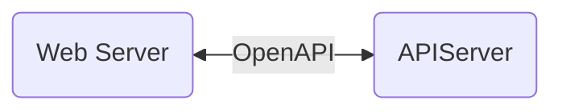

# 2. Swagger（API仕様）

## 2.1 Swagger / OpenAPI とは

RESTful APIのインターフェースを機械可読なYAMLやJSON形式で記述する標準規格。

```mermaid
graph LR
    a(Web Server) <-- OpenAPI --> b(APIServer)
```
## 2.2 Swagger UI の使い方
API の一覧を確認
リクエストパラメータを確認
実際に API を叩いてレスポンスを確認

