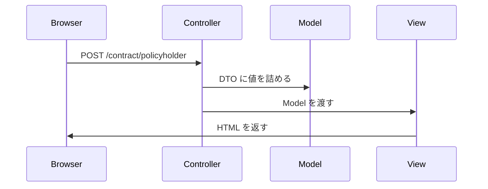

# 3. 画面（Thymeleaf）

## 3.1 画面構成

```mermaid
flowchart LR
    TOP --> Policyholder
    Policyholder --> Insured
    Insured --> Confirm
    Confirm --> Complete
```
## 3.2 Thymeleaf の基本構文
・`th:text`

・`th:each`

・`th:if`

・`th:field`
## 3.3 フォーム送信の流れ

```mermaid
sequenceDiagram
    participant B as Browser
    participant C as Controller
    participant M as Model
    participant V as View

    B->>C: POST /contract/policyholder
    C->>M: DTO に値を詰める
    C->>V: Model を渡す
    V->>B: HTML を返す
```