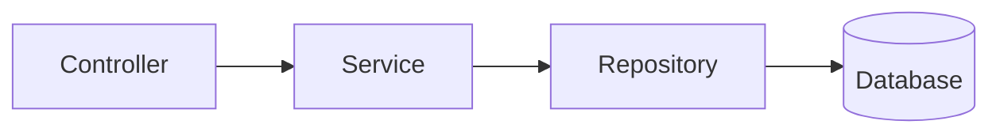

# 4. API サーバ（Product / Plan / Application）

## 4.1 API サーバの役割

- 画面からのリクエストを受けてデータを返す  
- Product / Plan のマスタ提供  
- Application の登録処理  

---

## 4.2 API の構造

## 4.3 OpenAPI 生成クライアントの利用
DefaultApi

ApiClient

@LoadBalanced RestTemplate

BasePath を Eureka のサービス名に変更