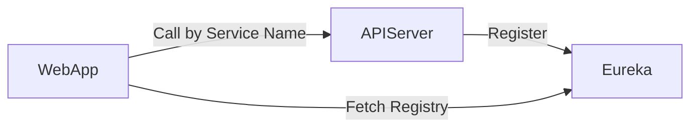

# 6. Eureka（サービスディスカバリ）

## 6.1 サービスディスカバリとは

API サーバの場所（IP/Port）を  
**自動で見つける仕組み**。

---

## 6.2 Eureka の仕組み

## 6.3 Spring Cloud LoadBalancer
サービス名で API を呼び出す

@LoadBalanced RestTemplate

OpenAPI クライアントの BasePath をサービス名に変更