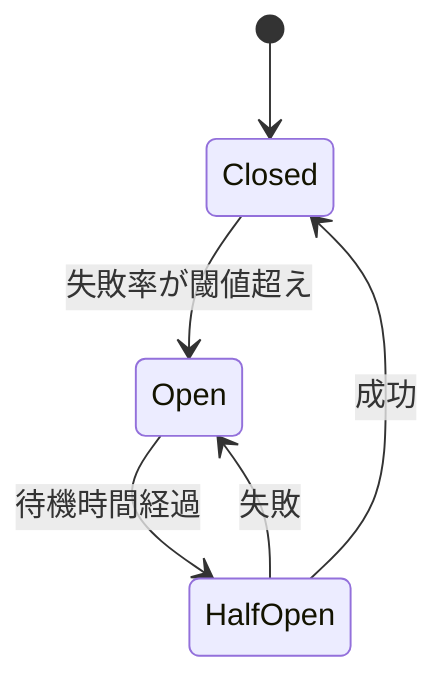

# 7. Resilience4j（サーキットブレーカー）

## 7.1 なぜ必要か

- API 障害時の graceful degradation  
- 障害連鎖の防止  

---

## 7.2 サーキットブレーカーの状態

```mermaid
stateDiagram-v2
    [*] --> Closed
    Closed --> Open: 失敗率が閾値超え
    Open --> HalfOpen: 待機時間経過
    HalfOpen --> Closed: 成功
    HalfOpen --> Open: 失敗
```
## 7.3 実装
@CircuitBreaker

fallback メソッド

application.yml の設定